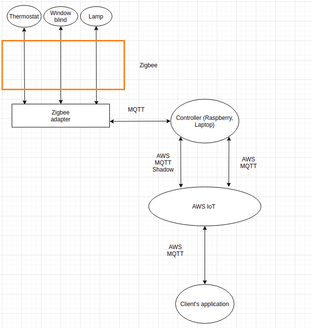

# IoT Project - Smart Home
This project is a POC of a system allowing users to manage their home devices in order to change home themes.

## Devices 
* Lamp - https://www.zigbee2mqtt.io/devices/AU-A1GSZ9RGBW.html
* Thermostat - https://www.zigbee2mqtt.io/devices/Zen-01-W.html
* Curtains - https://www.zigbee2mqtt.io/devices/W40CZ.html

## System diagram
<div style="text-align:center"></div>

## Run
```console
sudo service mosquitto start
python simulator/simulator.py
python controller/controller.py
python app/app.py
```
Also you have to be running zigbee software, you can download it from https://www.zigbee2mqtt.io/.  
